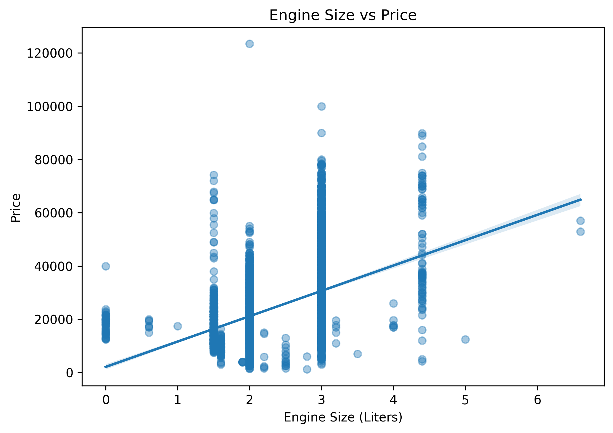
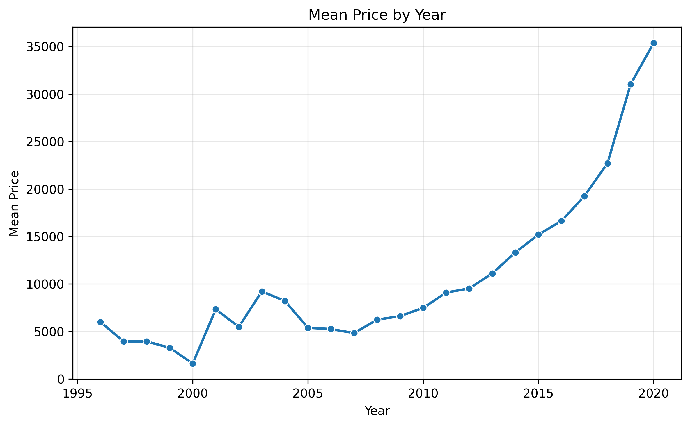
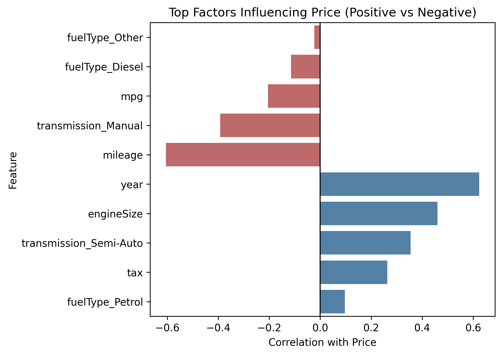

source: https://www.kaggle.com/datasets/thedrzee/bmw-carsdataset

Cars by fuel type

Engine size distribution

Engine size vs price

Mean price by mileage category

Mean price by year

Mileage distribution

Mileage vs price

Mileage vs year

Mpg distribution

Mpg vs price

Numerical features correlation lower triangle

Price distribution

Price distribution by fuel type

Price distribution by transmission type

Top price influencers

