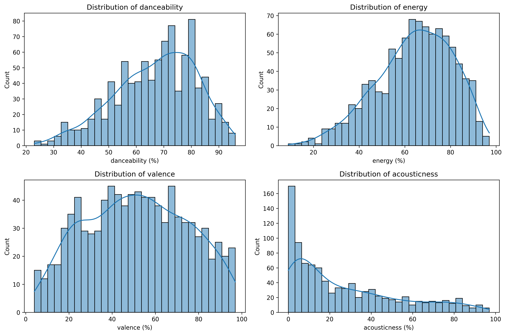
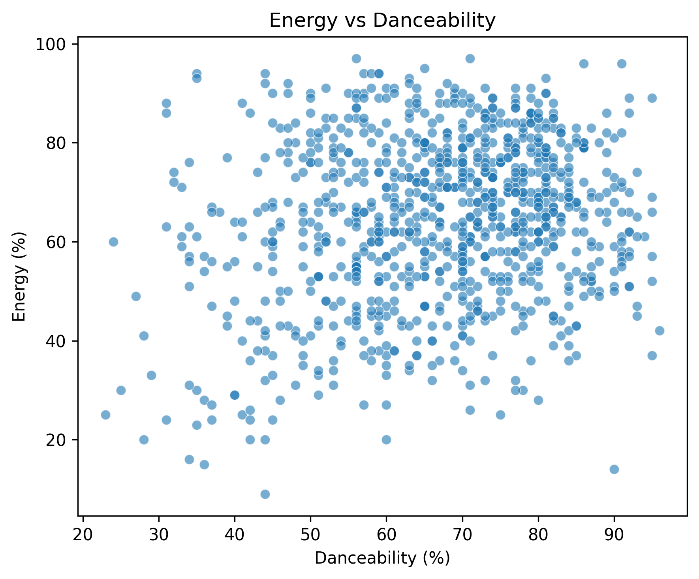
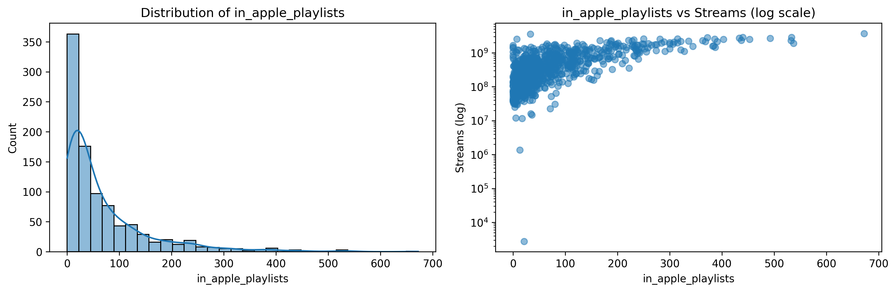
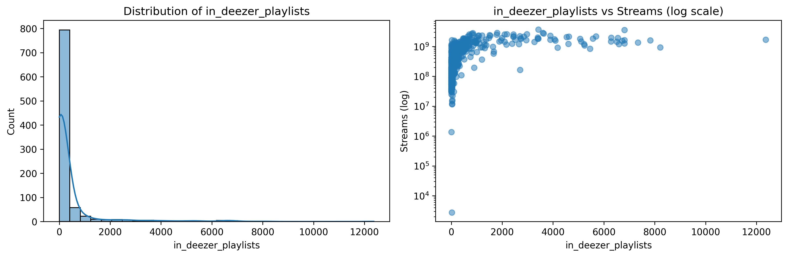
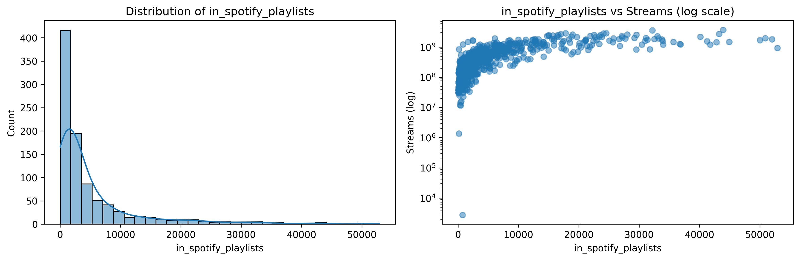
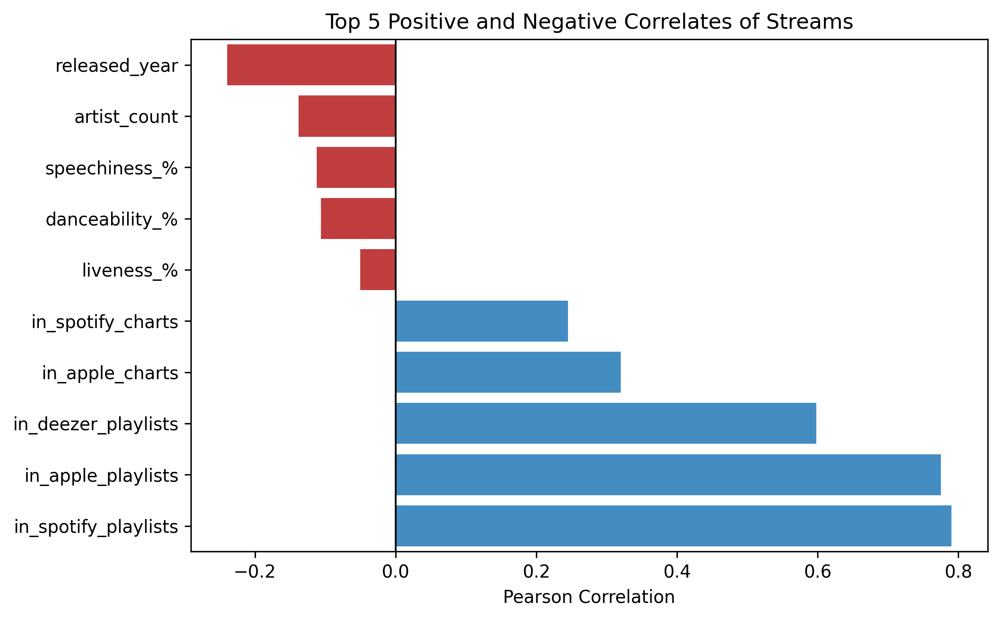

source: https://www.kaggle.com/datasets/nelgiriyewithana/top-spotify-songs-2023!

Audio feature distributions

Bpm distribution

Correlation of features with streams

Correlation of streams with playlist features

Energy vs danceability

In apple playlists distribution and vs streams

In deezer playlists distribution and vs streams

In spotify playlists distribution and vs streams

Mean streams by artist count

Number of tracks in charts by platform

Top10 streams correlations

